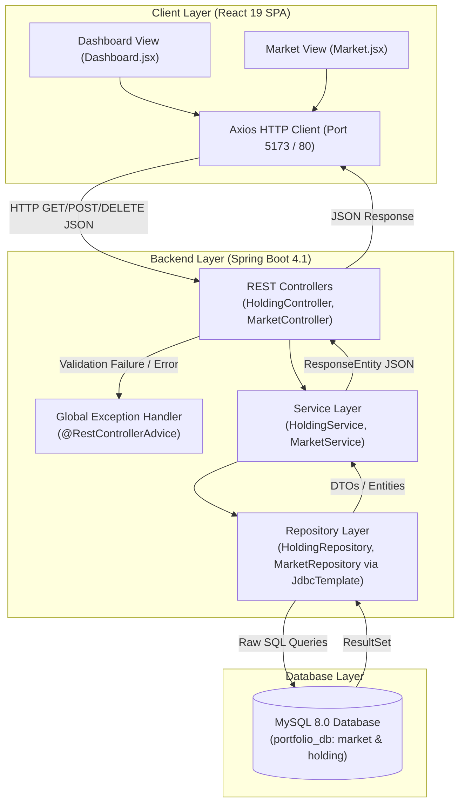

# 📈 EquityFlow Portfolio Manager

[](https://www.oracle.com/java/)
[](https://spring.io/projects/spring-boot)
[](https://react.dev/)
[](https://vitejs.dev/)
[](https://tailwindcss.com/)
[](https://www.mysql.com/)
[](https://www.docker.com/)
[](https://www.jenkins.io/)
[](LICENSE)

An enterprise-grade, full-stack financial asset tracking, portfolio analytics, and market monitoring platform built by team **Runtime Rangers**. The system provides real-time portfolio performance insights, sector allocation breakdowns, automated top gainers/losers market feeds, and AI-powered investment advisory insights.

---

## 💡 Project Overview

### What the Project Does
**EquityFlow Portfolio Manager** is a comprehensive financial web application designed to help retail and institutional investors track, manage, and analyze stock holdings across diverse asset classes and market sectors. It presents an intuitive dashboard for monitoring investment performance, cost bases, profit/loss margins, and asset concentration.

### The Problem It Solves
Managing stock investments across multiple exchanges (NASDAQ, NYSE, NSE, Crypto) often involves manual spreadsheet tracking, complex gain/loss math, and fragmented market research. Portfolio Manager solves these pain points by:
- Automating cost basis vs. current valuation calculations in real time.
- Calculating portfolio sector weightings dynamically using SQL aggregations.
- Identifying top market movers (gainers and losers) instantaneously.
- Providing AI-driven portfolio recommendations (Buy/Sell/Hold advice) via Groq LLM integration.

### Purpose and Goals
- **Financial Metrics**: Instant access to total capital invested, current market valuation, total gain/loss, and net rate of return percentage.
- **Data-Driven Asset Allocation**: Interactive visualization of stock weightings and sector concentration via Recharts charts.
- **High-Throughput Lightweight Backend**: Spring Boot 4.1 using Spring Data JDBC (`JdbcTemplate`) for low ORM overhead and high execution performance.
- **Enterprise DevOps Pipeline**: Multi-stage Docker containerization and automated Jenkins CI/CD integration.

---

## ⚡ Key Features

- 📊 **Real-Time Portfolio Valuation Engine**: Automatically calculates net capital invested, current total market value, net gain/loss, and return percentage (`growthPercentage`).
- 🥧 **Dynamic Asset & Sector Allocation**: Computes exact percentage concentration per holding and sector using SQL `GROUP BY` and aggregation queries.
- 📈 **Market Movers Feed**: Real-time ranking of top 5 gainers and top 5 losers sorted by change percentage (`change_percent`).
- 🤖 **AI Financial Advisor & Market Scanner**: Integrates with Groq LLM API (`llama-3.3-70b-versatile`) to generate concise, professional Buy/Sell/Hold insights for holdings and market stocks.
- 💼 **Position Management**: Supports buying new stock positions, updating existing position quantities, and selling/deleting holdings.
- 🛡️ **Centralized Global Exception Handling**: `@RestControllerAdvice` intercepts validation failures, malformed JSON inputs, resource missing cases, and database errors to return structured HTTP error payloads.
- 🐳 **Full Dockerization**: Multi-stage `Dockerfile` and `docker-compose.yml` orchestrating MySQL 8.0, Spring Boot backend, and Nginx React frontend.
- 🔄 **Automated CI/CD Pipeline**: Declarative `Jenkinsfile` automating code checkout, backend testing with H2, JAR packaging, frontend build validation, environment setup, container deployment, and health checks.
- 📖 **Interactive OpenAPI Docs**: Integrated Swagger UI via `springdoc-openapi` for API exploration and testing.

---

## 🧩 Functional Modules

### 1. Market Module (`com.neueda.portfolio_manager.controller.MarketController`)
- **Purpose**: Exposes endpoints to retrieve master stock catalog data and analytics on market movers.
- **Responsibilities**: Interface between the frontend client and the market data repository.
- **Main Functionalities**:
    - Retrieve complete list of available market stocks (`GET /api/market`).
    - Fetch top 5 gainers ordered by positive change percentage (`GET /api/market/gainers`).
    - Fetch top 5 losers ordered by negative change percentage (`GET /api/market/losers`).

### 2. Holding & Portfolio Module (`com.neueda.portfolio_manager.controller.HoldingController`)
- **Purpose**: Manages user stock holdings and generates aggregated portfolio performance metrics.
- **Responsibilities**: Handles transactions (buy/update/delete holdings) and computes financial position metrics.
- **Main Functionalities**:
    - Add a new stock holding (`POST /api/holdings`).
    - Update holding quantity by ID (`PUT /api/holdings/{id}`).
    - Update holding quantity by Market ID (`PUT /api/holding/market/{marketId}`).
    - Remove a stock holding (`DELETE /api/holdings/{id}`).
    - Retrieve detailed portfolio holding allocations (`GET /api/portfolio/allocation`).
    - Retrieve sector concentration breakdowns (`GET /api/portfolio/sectors`).
    - Retrieve portfolio summary statistics (`GET /api/portfolio/summary`).

### 3. Frontend Client & AI Module (`frontend/src`)
- **Purpose**: Provides an intuitive dark-themed user interface with interactive charts, tables, search features, and AI insights.
- **Responsibilities**: Renders UI components, interacts with REST endpoints using Axios, and communicates with the Groq AI API.
- **Main Functionalities**:
    - **Dashboard View**: Renders key metric cards (Total Investment, Portfolio Value, Profit/Loss, Return %), pie charts, AI Advisor card, and interactive holdings table with sell flow modals.
    - **Market View**: Renders stock search bar, top gainers/losers carousel cards, AI Market Scanner, and comprehensive market stock catalog.

---

## 🛠️ Technology Stack

| Category | Technology | Version | Purpose |
| :--- | :--- | :--- | :--- |
| **Backend Language** | Java | 17 | Core programming language |
| **Backend Framework** | Spring Boot | 4.1.0 | Microservice web framework |
| **Data Access** | Spring Data JDBC (`JdbcTemplate`) | 4.1.0 | Lightweight raw SQL data access layer |
| **Database (Production)** | MySQL | 8.0 | Relational database persistence |
| **Database (Testing)** | H2 Database | In-Memory | Embedded database for unit/integration tests |
| **API Documentation** | Springdoc OpenAPI / Swagger | 2.8.9 | Contract-first REST documentation |
| **Frontend Framework** | React | 19.1.0 | Single-Page Application (SPA) framework |
| **Frontend Build Tool** | Vite | 6.3.5 | Fast Next-gen frontend tooling |
| **UI Styling & Icons** | Tailwind CSS / Lucide / React Icons | 4.3.3 | Dark-themed glassmorphism responsive styling |
| **Data Visualization** | Recharts | 3.10.1 | Interactive charts (Pie/Donut charts) |
| **AI Integration** | Groq API (`llama-3.3-70b-versatile`) | API v1 | AI portfolio advisor & market scanner |
| **HTTP Client** | Axios | 1.19.0 | Promise-based HTTP client for API calls |
| **Containerization** | Docker / Docker Compose | Multi-Stage | Microservices packaging and orchestration |
| **Web Server / Proxy** | Nginx | Alpine | Frontend SPA production web server |
| **CI/CD Automation** | Jenkins | Pipeline | Declarative build, test, and deployment automation |

---

## 📐 System Architecture

### Component Interaction Flow

```
User (Browser)
   │
   ├─► Client Layer (React 19 SPA) [Port 5173 Dev / Port 8085 Prod]
   │      │
   │      ├─► Axios HTTP Client
   │            │
   │            ▼  (JSON over HTTP / REST)
   │
   ├─► Server Layer (Spring Boot 4.1 REST APIs) [Port 8082]
   │      │
   │      ├─► HoldingController / MarketController
   │      ├─► GlobalExceptionHandler (@RestControllerAdvice)
   │      ├─► HoldingService / MarketService
   │      └─► HoldingRepository / MarketRepository (JdbcTemplate)
   │            │
   │            ▼  (Raw SQL Queries)
   │
   └─► Database Layer (MySQL 8.0) [Port 3306] (Database: portfolio_db)
```

### Detailed System Architecture Diagram



---

## 📁 Project Structure

```
.
├── Dockerfile                         # Multi-stage Docker build script for backend & frontend
├── docker-compose.yml                 # Multi-container orchestration (MySQL, Backend, Frontend)
├── Jenkinsfile                        # Declarative Jenkins CI/CD pipeline script
├── README.md                          # Project documentation
│
├── backend                            # Spring Boot Java Backend
│   ├── pom.xml                        # Maven dependencies & build settings
│   └── src
│       ├── main
│       │   ├── java
│       │   │   └── com/neueda/portfolio_manager
│       │   │       ├── PortfolioManagerApplication.java
│       │   │       ├── controller     # REST Controllers handling HTTP requests
│       │   │       │   ├── HoldingController.java
│       │   │       │   └── MarketController.java
│       │   │       ├── entity         # Data Models & DTOs
│       │   │       │   ├── Holding.java
│       │   │       │   ├── HoldingAllocation.java
│       │   │       │   ├── Market.java
│       │   │       │   └── SectorAllocation.java
│       │   │       ├── exception      # Global Exception Handling & custom exceptions
│       │   │       │   ├── BadRequestException.java
│       │   │       │   ├── DuplicateResourceException.java
│       │   │       │   ├── GlobalExceptionHandler.java
│       │   │       │   └── ResourceNotFoundException.java
│       │   │       ├── repository     # Spring Data JDBC Repositories (JdbcTemplate)
│       │   │       │   ├── HoldingRepository.java
│       │   │       │   └── MarketRepository.java
│       │   │       └── service        # Business Logic Layer
│       │   │           ├── HoldingService.java
│       │   │           └── MarketService.java
│       │   └── resources
│       │       ├── application.properties      # Base Spring Boot properties
│       │       ├── application-dev.properties  # Development environment properties (MySQL)
│       │       ├── application-test.properties # Testing environment properties (H2 DB)
│       │       ├── schema.sql                  # Database table definitions
│       │       └── data.sql                    # Initial seed dataset
│       └── test                       # Unit and Integration Tests
│           └── java/com/neueda/portfolio_manager
│               ├── PortfolioManagerApplicationTests.java
│               ├── controller
│               │   ├── HoldingControllerTest.java
│               │   └── MarketControllerTest.java
│               ├── repository
│               │   ├── HoldingRepositoryTest.java
│               │   └── MarketRepositoryTest.java
│               └── service
│                   ├── HoldingServiceTest.java
│                   └── MarketServiceTest.java
│
└── frontend                           # React 19 Frontend SPA
    ├── package.json                   # NPM dependencies and scripts
    ├── vite.config.js                 # Vite bundler configuration
    ├── nginx.conf                     # Nginx Web Server configuration for production
    ├── index.html                     # HTML5 Entry point
    └── src
        ├── main.jsx                   # React application entry point
        ├── App.jsx                    # Core layout router component
        ├── api                        # Axios API integration modules
        │   ├── aiApi.js               # Groq LLM integration
        │   ├── axiosInstance.js       # Base Axios instance with baseURL
        │   ├── holdingApi.js          # Holding API calls
        │   ├── marketApi.js           # Market API calls
        │   └── portfolioApi.js        # Portfolio API calls
        ├── components                 # Modular React UI components
        │   ├── dashboard              # Summary cards, pie charts, holdings table, AI advisor
        │   ├── layout                 # Header and Navbar navigation
        │   └── market                 # Search bar, top movers, market table, AI scanner
        └── Pages                      # Top-level routes
            ├── Dashboard.jsx          # Investment overview page
            └── Market.jsx             # Stock market research page
```

### Package Descriptions
- `controller`: Handles incoming HTTP requests, maps REST endpoints, validates input payloads, and returns `ResponseEntity` JSON responses.
- `service`: Contains business logic, validation rules, portfolio calculation algorithms, and delegates database operations to repositories.
- `repository`: Implements data persistence using `JdbcTemplate` to execute SQL queries directly against MySQL/H2 databases.
- `entity`: Represents database tables (`Market`, `Holding`) and analytical data transfer objects (`HoldingAllocation`, `SectorAllocation`).
- `exception`: Provides centralized `@RestControllerAdvice` error handling, returning clean HTTP status codes and error JSON structures.

---

## 🗄️ Database Design

### Relational Schema Diagram

```
       +-----------------------+              +-----------------------+
       |        market         |              |        holding        |
       +-----------------------+              +-----------------------+
       | PK  id (INT)          |<------------| PK  id (INT)          |
       |     symbol (VARCHAR)  | 1          * | FK  market_id (INT)   |
       |     company_name (VC) |              |     quantity (INT)    |
       |     exchange (VARCHAR)|              |     purchase_price(DEC|
       |     sector (VARCHAR)  |              |     purchase_date(DT) |
       |     current_price(DEC)|              +-----------------------+
       |     change_percent(DEC|
       +-----------------------+
```

### Table Definitions

#### 1. `market` Table
Stores master data for tracked securities and stocks.

| Column | Type | Constraints | Description |
| :--- | :--- | :--- | :--- |
| `id` | `INT` | `PRIMARY KEY, AUTO_INCREMENT` | Unique identifier for market security |
| `symbol` | `VARCHAR(10)` | `NOT NULL, UNIQUE` | Stock ticker symbol (e.g., AAPL, TSLA, BTC) |
| `company_name` | `VARCHAR(100)`| `NOT NULL` | Full company name |
| `exchange` | `VARCHAR(50)` | `NULLABLE` | Listing exchange (NASDAQ, NYSE, CRYPTO, NSE) |
| `sector` | `VARCHAR(50)` | `NULLABLE` | Industry sector (Technology, Automotive, ETF, etc.) |
| `current_price`| `DECIMAL(10,2)`| `NULLABLE` | Latest market price per unit |
| `change_percent`|`DECIMAL(6,2)` | `DEFAULT 0` | Percentage price change for top movers tracking |

#### 2. `holding` Table
Stores user portfolio positions linked to market securities.

| Column | Type | Constraints | Description |
| :--- | :--- | :--- | :--- |
| `id` | `INT` | `PRIMARY KEY, AUTO_INCREMENT` | Unique identifier for holding position |
| `market_id` | `INT` | `NOT NULL, FK -> market(id)` | Foreign key linking to the `market` table |
| `quantity` | `INT` | `NOT NULL` | Number of shares/units owned |
| `purchase_price`|`DECIMAL(10,2)`| `NULLABLE` | Price per unit at purchase |
| `purchase_date` |`DATE` | `NULLABLE` | Date of acquisition |

### Foreign Key Constraints
- `fk_holding_market`: `holding.market_id` references `market.id`.

### Database Initialization
- `schema.sql`: Drops existing tables if present and recreates `market` and `holding` tables.
- `data.sql`: Seeds 14 initial market stocks (AAPL, TSLA, MSFT, AMZN, GOOGL, BTC, ETH, VOO, SIP500, JPM, GOLDETF, BND, NVDA, HDFCBANK) and 13 sample portfolio holdings across profit and loss scenarios.
- Controlled in `application.properties` via `spring.sql.init.mode=always`.

---

## 📡 API Documentation

All REST APIs are exposed under the `/api` prefix.

| HTTP Method | Endpoint | Description | Request Body / Parameters | Response Status & Body |
| :--- | :--- | :--- | :--- | :--- |
| `GET` | `/api/market` | Retrieve complete list of market stocks | None | `200 OK` - Array of `Market` objects |
| `GET` | `/api/market/gainers` | Retrieve top 5 market gainers | None | `200 OK` - Top 5 `Market` objects sorted by `change_percent DESC` |
| `GET` | `/api/market/losers` | Retrieve top 5 market losers | None | `200 OK` - Top 5 `Market` objects sorted by `change_percent ASC` |
| `POST` | `/api/holdings` | Create a new stock holding | JSON: `{ "marketId": 1, "quantity": 10, "purchasePrice": 180.00, "purchaseDate": "2026-01-15" }` | `201 Created` - Created `Holding` object |
| `PUT` | `/api/holdings/{id}` | Update holding position by Holding ID | Path: `id` (int)<br/>JSON: `{ "marketId": 1, "quantity": 5, "purchasePrice": 180.00, "purchaseDate": "2026-01-15" }` | `204 No Content` on success<br/>`404 Not Found` if ID does not exist |
| `PUT` | `/api/holding/market/{marketId}` | Update holding position by Market ID | Path: `marketId` (int)<br/>JSON: `{ "quantity": 15, "purchasePrice": 180.00, "purchaseDate": "2026-01-15" }` | `204 No Content` on success<br/>`404 Not Found` if position does not exist |
| `DELETE` | `/api/holdings/{id}` | Delete holding position by Holding ID | Path: `id` (int) | `204 No Content` on success<br/>`400 Bad Request` / `404 Not Found` if missing |
| `GET` | `/api/portfolio/allocation` | Retrieve detailed holding allocations | None | `200 OK` - Array of `HoldingAllocation` (invested, current value, gain/loss, allocation %) |
| `GET` | `/api/portfolio/sectors` | Retrieve sector allocation breakdown | None | `200 OK` - Array of `SectorAllocation` (total quantity, invested value, current value, sector %) |
| `GET` | `/api/portfolio/summary` | Retrieve overall portfolio summary KPIs | None | `200 OK` - `{ "totalInvestedValue": 15000.0, "totalCurrentValue": 17500.0, "totalGainLoss": 2500.0, "growthPercentage": 16.67 }` |

### Swagger / OpenAPI Documentation
When running the backend locally, Swagger UI is available at:
`http://localhost:8082/swagger-ui/index.html` or `http://localhost:8082/v3/api-docs`

---

## 🐳 Docker & Containerization

The project includes a production-ready multi-stage `Dockerfile` and `docker-compose.yml` configuration.

### Network Ports Mapping

| Service | Container Port | Host Port | Protocol | Purpose |
| :--- | :--- | :--- | :--- | :--- |
| **MySQL Database** | `3306` | `3306` | TCP / Database | Relational database storage |
| **Spring Boot Backend** | `8082` | `8082` | HTTP / REST | Backend API service |
| **React Frontend (Nginx)** | `80` | `8085` | HTTP / Web | Frontend SPA production web server |
| **Vite Dev Server** | `5173` | `5173` | HTTP / Web | Local development server |

### Multi-Stage Docker Architecture
1. **Backend Stage**:
    - `backend-builder`: Uses `maven:3.9.6-eclipse-temurin-17` to compile code and package the Spring Boot JAR with `-DskipTests`.
    - `backend`: Runtime stage using light `eclipse-temurin:17-jre-alpine`, running under non-root user `pmuser`, with health checks on `http://localhost:8082/api/market`.
2. **Frontend Stage**:
    - `frontend-builder`: Uses `node:20-alpine` to install dependencies and execute `npm run build`.
    - `frontend`: Production Nginx server copying build artifacts to `/usr/share/nginx/html`, exposing port 80 (mapped to host 8085), with SPA fallback configured in `nginx.conf`.

---

## 🔄 Continuous Integration & Delivery (Jenkins)

The repository features a robust declarative `Jenkinsfile` automating end-to-end integration and delivery.

### Pipeline Stages
1. **Checkout Source**: Clones specified branch into isolated workspace directory.
2. **Validate Agent Tooling**: Verifies availability of Git, Docker, and Docker Compose CLI commands on Linux agent.
3. **Test Backend**: Executes unit tests via `./mvnw -B clean test -Dspring.profiles.active=test` and publishes JUnit XML test reports.
4. **Build Backend**: Compiles and packages backend executable JAR artifact.
5. **Validate Frontend**: Runs `npm ci` and `npm run build` validation.
6. **Prepare Deployment Env**: Dynamically injects database credentials and `VITE_GROQ_KEY` from Jenkins Credentials Manager into `.env`.
7. **Deploy MySQL**: Spawns MySQL 8.0 container and polls container healthcheck until status is `healthy`.
8. **Deploy Application**: Builds and starts backend and frontend services using `docker compose up -d --build`.
9. **Health Check**: Executes `curl -fsS http://localhost:8082/api/market` and `curl -fsS http://localhost:8085/health` to verify runtime health.

---

## ⚙️ Configuration

### Important Configuration Files

#### 1. Backend (`application.properties`)
```properties
spring.application.name=portfolio-manager
spring.datasource.driver-class-name=com.mysql.cj.jdbc.Driver
server.port=8082
spring.sql.init.mode=always
spring.datasource.hikari.connection-timeout=30000
spring.datasource.hikari.initialization-fail-timeout=60000
```

#### 2. Development Profile (`application-dev.properties`)
```properties
spring.datasource.url=jdbc:mysql://mysql:3306/portfolio_db
spring.datasource.username=root
spring.datasource.password=n3u3da!
spring.sql.init.mode=always
```

#### 3. Test Profile (`application-test.properties`)
```properties
spring.datasource.url=jdbc:h2:mem:testdb;MODE=MySQL
spring.datasource.username=sa
spring.datasource.password=
spring.datasource.driver-class-name=org.h2.Driver
spring.sql.init.mode=never
```

#### 4. Frontend Axios Instance (`axiosInstance.js`)
Configures base API endpoint targeting the backend REST service:
```javascript
import axios from "axios";

const api = axios.create({
  baseURL: "http://localhost:8082/api",
});

export default api;
```

### Environment Variables

| Variable Name | Required | Default Value | Description |
| :--- | :--- | :--- | :--- |
| `MYSQL_ROOT_PASSWORD` | No | `n3u3da!` | Root password for MySQL database |
| `MYSQL_DATABASE` | No | `portfolio_db` | MySQL database name |
| `MYSQL_USER` | No | `portfolio_user` | MySQL service username |
| `MYSQL_PASSWORD` | No | `portfolio_password` | MySQL service password |
| `VITE_GROQ_KEY` | Optional | None | Groq API Key for AI portfolio/market insights |
| `SPRING_PROFILES_ACTIVE`| No | `dev` | Active Spring profile (`dev` or `test`) |

> 🔒 **Security Notice**: Never commit sensitive production database passwords or Groq API keys to public source control. Use environment variables or Jenkins Credentials Manager.

---

## 💻 Installation and Setup

### Prerequisites
Ensure the following tools are installed on your machine:
- **Java JDK 17** or higher
- **Node.js 20+** and **npm**
- **MySQL 8.0** server (if running without Docker)
- **Docker** and **Docker Compose** (for containerized deployment)

---

### Method 1: Docker Compose Setup (Recommended)

1. **Clone the Repository**:
   ```bash
   git clone https://github.com/Neueda-Learning/106-Portfolio-Manager-Runtime-Rangers.git
   cd 106-Portfolio-Manager-Runtime-Rangers
   ```

2. **Set Environment Variables (Optional)**:
   Create a `.env` file in the project root:
   ```env
   MYSQL_ROOT_PASSWORD=n3u3da!
   MYSQL_DATABASE=portfolio_db
   MYSQL_USER=portfolio_user
   MYSQL_PASSWORD=portfolio_password
   VITE_GROQ_KEY=your_groq_api_key_here
   ```

3. **Start Containers**:
   ```bash
   docker compose up -d --build
   ```

4. **Verify Container Services**:
   ```bash
   docker compose ps
   ```
    - **Frontend App**: Accessible at `http://localhost:8085`
    - **Backend API**: Accessible at `http://localhost:8082/api/market`
    - **Swagger Docs**: Accessible at `http://localhost:8082/swagger-ui/index.html`

---

### Method 2: Manual Local Setup (Without Docker)

#### 1. Start MySQL Database
- Create database `portfolio_db`:
  ```sql
  CREATE DATABASE portfolio_db;
  ```

#### 2. Run Backend (Spring Boot)
1. Navigate to backend directory:
   ```bash
   cd backend
   ```
2. Build and run using Maven wrapper:
   ```bash
   ./mvnw spring-boot:run -Dspring-boot.run.profiles=dev
   ```
   Backend starts on `http://localhost:8082`.

#### 3. Run Frontend (React + Vite)
1. Navigate to frontend directory:
   ```bash
   cd frontend
   ```
2. Install dependencies:
   ```bash
   npm install
   ```
3. Start Vite development server:
   ```bash
   npm run dev
   ```
   Frontend starts on `http://localhost:5173`.

---


## 👥 Contributors

Developed with ❤️ by team **Runtime Rangers**:

- **Runtime Rangers Engineering Team** (Neueda Software Engineering Program)
- Technical Stack lead: Backend (Java/Spring Boot), Frontend (React 19), DevOps (Docker & Jenkins).

---

## 📜 License

This project is licensed under the **MIT License** - see the [LICENSE](LICENSE) file for details.
