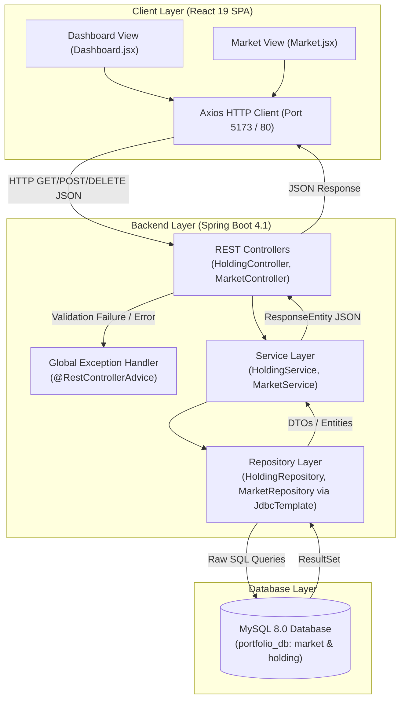
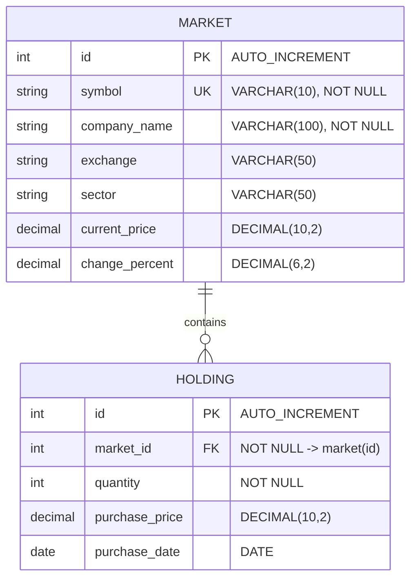
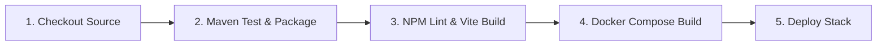

<div align="center">

# 📈 Portfolio Manager

**A full-stack financial asset tracking and portfolio analytics platform.**

[](https://www.oracle.com/java/)
[](https://spring.io/projects/spring-boot)
[](https://react.dev/)
[](https://vitejs.dev/)
[](https://tailwindcss.com/)
[](https://www.mysql.com/)
[](https://www.docker.com/)
[](https://www.jenkins.io/)
[](https://swagger.io/)
[](LICENSE)

---

</div>

## 📌 Table of Contents
- [Executive Overview](#-executive-overview)
- [Key Architectural Features](#-key-architectural-features)
- [Functional Modules](#-functional-modules)
- [Technology Stack](#-technology-stack)
- [System Architecture](#-system-architecture)
- [Project Structure](#-project-structure)
- [Database Schema & Data Model](#-database-schema--data-model)
- [API Specification](#-api-specification)
- [Error Handling Strategy](#-error-handling-strategy)
- [Docker Support & Containerization](#-docker-support--containerization)
- [Continuous Integration & Delivery (Jenkins)](#-continuous-integration--delivery-jenkins)
- [Configuration Reference (`application.properties`)](#-configuration-reference-applicationproperties)
- [Installation & Local Setup](#-installation--local-setup)
- [Testing & Quality Assurance](#-testing--quality-assurance)
- [UI Screenshots](#-ui-screenshots)
- [Engineering Roadmap](#-engineering-roadmap)
- [Contributors & Credits](#-contributors--credits)
- [License](#-license)

---

## 💡 Executive Overview

### Project Context
**Portfolio Manager** is a high-performance full-stack web application built to eliminate manual portfolio monitoring and financial data aggregation overhead for individual and institutional investors.

### Core Problem Solved
Managing equity portfolios across multiple sectors requires tracking volatile market valuations, computing weighted asset distributions, calculating cost-basis vs. current market value, and monitoring top-performing or underperforming assets. Portfolio Manager automates these calculations by providing real-time financial metrics, aggregated sector weightings, position allocation percentages, and automated market mover analytics.

### Strategic Goals
- **Real-time Financial Analytics**: Instant calculation of total capital invested, current market portfolio value, net unrealized gain/loss, and rate of return.
- **Dynamic Asset Allocation**: Interactive visualization of equity weightings and sector concentration via Recharts pie charts.
- **Lightweight & High-Throughput Backend**: Spring Data JDBC with raw `JdbcTemplate` execution for minimum ORM overhead and predictable SQL performance.
- **Contract-First OpenAPI Specs**: Self-documenting REST APIs exposed via Swagger UI for seamless front-end and third-party integrations.

---

## ⚡ Key Architectural Features

- 📊 **Portfolio Valuation Engine**: Computes total invested value, current market valuation, net profit/loss, and portfolio return rate on the fly.
- 🥧 **Asset Weighting & Sector Breakdown**: Dynamic SQL aggregation queries compute exact percentage allocation by stock holding and industry sector.
- 📈 **Market Mover Widgets**: Optimized SQL sorting routines (`ORDER BY change_percent`) to fetch top 5 gainers and top 5 losers.
- 🛡️ **Centralized Resilience & Exception Handling**: `@RestControllerAdvice` intercepts database exceptions, invalid JSON payloads, and illegal arguments to output uniform RFC 7807-compliant error payloads.
- 🐳 **Containerized Microservices Stack**: Production-ready multi-stage Dockerfiles and Docker Compose setup for unified one-command orchestration.
- 🔄 **Automated CI/CD Pipeline**: Declarative `Jenkinsfile` orchestrating automated checkout, compilation, linting, Docker image builds, and container deployment.
- 🚀 **Modern Reactive-Ready UI**: Single-page application (SPA) built with React 19, TailwindCSS 4 dark theme, and Vite build system.
- 🔄 **Self-Bootstrapping Relational Persistence**: Automatic execution of `schema.sql` and `data.sql` DDL/DML scripts on Spring Boot initialization (`spring.sql.init.mode=always`).

---

## 🧩 Functional Modules

```
                    ┌─────────────────────────────────────────┐
                    │          Portfolio Manager App          │
                    └────────────────────┬────────────────────┘
                                         │
        ┌────────────────────────────────┼────────────────────────────────┐
        ▼                                ▼                                ▼
┌──────────────────────┐      ┌──────────────────────┐      ┌──────────────────────┐
│    Market Module     │      │   Holding Module     │      │   Analytics & UI     │
├──────────────────────┤      ├──────────────────────┤      ├──────────────────────┤
│ - Stock Master Data  │      │ - Add/Delete Holding │      │ - Real-time KPI Cards│
│ - Top Gainers Feed   │      │ - Allocation Engine  │      │ - Portfolio Pie Chart│
│ - Top Losers Feed    │      │ - Sector Distribution│      │ - Sector Pie Chart   │
│ - Market Search      │      │ - Portfolio Summary  │      │ - Interactive Tables │
└──────────────────────┘      └──────────────────────┘      └──────────────────────┘
```

### 1. Market Module (`com.neueda.portfolio_manager.controller.MarketController`)
- **Responsibilities**: Manages master market securities (ticker, company, exchange, sector, current price, change percentage).
- **Core Endpoints**:
    - `GET /api/market`: Returns full catalog of market securities.
    - `GET /api/market/gainers`: Returns top 5 stocks sorted by highest positive price change percentage.
    - `GET /api/market/losers`: Returns top 5 stocks sorted by highest negative price change percentage.

### 2. Holding & Portfolio Module (`com.neueda.portfolio_manager.controller.HoldingController`)
- **Responsibilities**: Manages user investment positions, calculates portfolio cost basis, market valuation, asset allocation, and sector exposure.
- **Core Endpoints**:
    - `POST /api/holdings`: Inserts a new holding position (market ID, quantity, purchase price, purchase date).
    - `DELETE /api/holdings/{id}`: Liquidation/removal of a portfolio holding position by primary key ID.
    - `GET /api/portfolio/allocation`: Computes holding-level allocation percentage and gain/loss metrics.
    - `GET /api/portfolio/sectors`: Computes sector-level aggregated quantity, invested value, current value, and percentage exposure.
    - `GET /api/portfolio/summary`: Aggregates total invested value, total current market value, and net gain/loss.

### 3. Frontend Visualization Module (`frontend/src`)
- **Responsibilities**: User dashboard rendering, component-driven UI states, chart animations, and API synchronization.
- **Pages**:
    - **Investment Overview (`/`)**: Key performance indicators (KPIs), Portfolio Allocation Chart, Sector Allocation Chart, Holdings Table.
    - **Market (`/market`)**: Stock Search Bar, Top Gainers / Losers Cards, Interactive Stock Catalog Table.

---

## 🛠️ Technology Stack

| Layer | Technology | Version | Purpose |
| :--- | :--- | :--- | :--- |
| **Language** | Java | 17 (LTS) | Core backend programming language. |
| **Backend Framework** | Spring Boot | 4.1.0 | Microservice foundation, dependency injection, and REST controllers. |
| **Persistence** | Spring Data JDBC | 4.1.0 Starter | `JdbcTemplate`-based data access without heavy JPA/Hibernate ORM caching overhead. |
| **Database** | MySQL | 8.0+ | Relational storage for market instruments and holding transactions. |
| **Database Driver** | MySQL Connector/J | 9.x | Runtime JDBC driver for MySQL connections. |
| **API Docs** | SpringDoc OpenAPI | 2.8.9 | Automated Swagger UI generation (`/swagger-ui.html`). |
| **Frontend Framework**| React | 19.1.0 | Declarative UI library for SPA component construction. |
| **Build Tool (FE)** | Vite | 6.3.5 | Next-generation frontend build engine & HMR dev server. |
| **Styling** | TailwindCSS | 4.3.3 | Utility-first CSS framework styled with custom dark-mode theme. |
| **Data Viz** | Recharts | 3.10.1 | SVG-based charting library for animated portfolio pie charts. |
| **HTTP Client** | Axios | 1.19.0 | Promise-based HTTP client for API requests. |
| **Routing** | React Router DOM | 7.18.2 | Client-side page routing (`/` and `/market`). |
| **Icons & UI** | Lucide React / React Icons | 1.28 / 5.7 | Clean vector iconography. |
| **Containerization** | Docker / Docker Compose | 24.0+ / 3.8 | Multi-stage image builds and full-stack container orchestration. |
| **CI/CD Automation** | Jenkins Pipeline | Groovy (`Jenkinsfile`) | Automated build, test, lint, image packaging, and deployment pipeline. |
| **Build Tool (BE)** | Apache Maven | Maven Wrapper | Dependency management and build lifecycle tool. |

---

## 🏗️ System Architecture

### Request Processing Flow



---

## 📂 Project Structure

```
106-Portfolio-Manager-Runtime-Rangers-main
├── Jenkinsfile                                # Declarative Jenkins CI/CD Pipeline Script
├── docker-compose.yml                         # Multi-container Docker Compose Orchestration File
├── backend                                    # Spring Boot Backend Project
│   ├── Dockerfile                             # Multi-stage Maven/JDK 17 Dockerfile
│   ├── .mvn/                                  # Maven Wrapper Binaries
│   ├── mvnw                                   # Maven Wrapper (Linux/macOS)
│   ├── mvnw.cmd                               # Maven Wrapper (Windows)
│   ├── pom.xml                                # Maven Dependencies & Build Configuration
│   └── src
│       ├── main
│       │   ├── java/com/neueda/portfolio_manager
│       │   │   ├── PortfolioManagerApplication.java   # Spring Boot Main Application Entrypoint
│       │   │   ├── config
│       │   │   │   └── SwaggerConfig.java             # OpenAPI / Swagger UI Config Bean
│       │   │   ├── controller
│       │   │   │   ├── HoldingController.java         # REST APIs for Portfolio & Holdings
│       │   │   │   └── MarketController.java          # REST APIs for Market Data & Movers
│       │   │   ├── entity
│       │   │   │   ├── Holding.java                   # Holding Domain Model
│       │   │   │   ├── HoldingAllocation.java         # Holding Projection DTO (Valuation & Allocation %)
│       │   │   │   ├── Market.java                    # Market Security Domain Model
│       │   │   │   └── SectorAllocation.java          # Sector Exposure DTO (Valuation & Concentration %)
│       │   │   ├── exception
│       │   │   │   ├── BadRequestException.java       # Custom 400 Exception
│       │   │   │   ├── DuplicateResourceException.java# Custom 409 Exception
│       │   │   │   ├── GlobalExceptionHandler.java    # Centralized @RestControllerAdvice Error Handler
│       │   │   │   └── ResourceNotFoundException.java # Custom 404 Exception
│       │   │   ├── repository
│       │   │   │   ├── HoldingRepository.java         # JdbcTemplate Repository for Holdings & Analytics
│       │   │   │   └── MarketRepository.java          # JdbcTemplate Repository for Market Securities
│       │   │   └── service
│       │   │       ├── HoldingService.java            # Business Logic for Holding Operations
│       │   │       └── MarketService.java             # Business Logic for Market Operations
│       │   └── resources
│       │       ├── application.properties             # Spring & Datasource Configurations
│       │       ├── data.sql                           # Seed Script for Market & Holding Tables
│       │       └── schema.sql                         # Database Creation & DDL Schema Script
│       └── test
│           └── java/com/neueda/portfolio_manager
│               └── PortfolioManagerApplicationTests.java # Context Loading Unit Tests
└── frontend                                   # React 19 + Vite Frontend Project
    ├── Dockerfile                             # Multi-stage Node/Nginx Alpine Dockerfile
    ├── eslint.config.js                       # ESLint Configuration
    ├── index.html                             # HTML5 Root Container
    ├── package.json                           # Frontend Dependencies & NPM Scripts
    ├── vite.config.js                         # Vite Bundler Settings
    └── src
        ├── App.css                            # Core App Styles
        ├── App.jsx                            # React Router Root Switch
        ├── main.jsx                           # React DOM Root Mounting Script
        ├── index.css                          # Tailwind CSS Directives & Global Theme
        ├── Pages
        │   ├── Dashboard.jsx                  # Investment Overview Dashboard Page
        │   └── Market.jsx                     # Market Explorer Page
        ├── components
        │   ├── dashboard
        │   │   ├── ChartCard.jsx              # Reusable Wrapper for Recharts Cards
        │   │   ├── HoldingTable.jsx           # Portfolio Holdings Data Table Component
        │   │   ├── PortfolioAllocation.jsx    # Holding Allocation Pie Chart Component
        │   │   ├── SectorAllocation.jsx       # Sector Breakdown Pie Chart Component
        │   │   └── SummaryCard.jsx            # Financial Summary Stat KPI Widget
        │   ├── layout
        │   │   ├── Header.jsx                 # Application Top Header Bar
        │   │   └── Navbar.jsx                 # Main Navigation Bar
        │   └── market
        │       ├── MarketTable.jsx            # Stock Market Data Catalog Table
        │       ├── SearchBar.jsx              # Stock Search Filter Component
        │       └── TopMovers.jsx              # Top Gainers / Losers Widget Cards
        └── mock
            ├── dashboard.js                   # Mock Holding Backup Data
            └── market.js                      # Mock Market Backup Data
```

---

## 🗄️ Database Schema & Data Model

### Entity-Relationship Diagram



### Table Definitions & Constraints

#### 1. `market` Table
Stores security metadata and current price movements.
```sql
CREATE TABLE IF NOT EXISTS market (
    id INT AUTO_INCREMENT PRIMARY KEY,
    symbol VARCHAR(10) NOT NULL UNIQUE,
    company_name VARCHAR(100) NOT NULL,
    exchange VARCHAR(50),
    sector VARCHAR(50),
    current_price DECIMAL(10,2),
    change_percent DECIMAL(6,2) DEFAULT 0
);
```

#### 2. `holding` Table
Stores individual stock acquisition transactions linked to a market instrument.
```sql
CREATE TABLE IF NOT EXISTS holding (
    id INT AUTO_INCREMENT PRIMARY KEY,
    market_id INT NOT NULL,
    quantity INT NOT NULL,
    purchase_price DECIMAL(10,2),
    purchase_date DATE,
    CONSTRAINT fk_holding_market FOREIGN KEY (market_id) REFERENCES market(id)
);
```

---

## 📡 API Specification

### Portfolio & Holding Endpoints (`/api`)

#### 1. Get Portfolio Summary
- **Endpoint**: `GET /api/portfolio/summary`
- **Description**: Returns overall portfolio investment totals, current market value, and net unrealized profit/loss.
- **Response (`200 OK`)**:
  ```json
  {
    "totalInvestedValue": 6424.0,
    "totalCurrentValue": 7323.5,
    "totalGainLoss": 899.5
  }
  ```

#### 2. Get Portfolio Allocation
- **Endpoint**: `GET /api/portfolio/allocation`
- **Description**: Returns allocation breakdown per holding including quantity, cost basis, current valuation, unrealized gain/loss, and portfolio allocation percentage.
- **Response (`200 OK`)**:
  ```json
  [
    {
      "holdingId": 3,
      "marketId": 3,
      "symbol": "MSFT",
      "companyName": "Microsoft Corporation",
      "sector": "Technology",
      "quantity": 8,
      "purchasePrice": 390.5,
      "currentPrice": 420.75,
      "investedValue": 3124.0,
      "currentValue": 3366.0,
      "gainLoss": 242.0,
      "allocationPercentage": 45.96
    },
    {
      "holdingId": 1,
      "marketId": 1,
      "symbol": "AAPL",
      "companyName": "Apple Inc",
      "sector": "Technology",
      "quantity": 10,
      "purchasePrice": 180.0,
      "currentPrice": 220.5,
      "investedValue": 1800.0,
      "currentValue": 2205.0,
      "gainLoss": 405.0,
      "allocationPercentage": 30.11
    }
  ]
  ```

#### 3. Get Sector Allocation
- **Endpoint**: `GET /api/portfolio/sectors`
- **Description**: Returns portfolio concentration aggregated by industry sector.
- **Response (`200 OK`)**:
  ```json
  [
    {
      "sector": "Technology",
      "totalQuantity": 18,
      "investedValue": 4924.0,
      "currentValue": 5571.0,
      "allocationPercentage": 76.07
    },
    {
      "sector": "Automotive",
      "totalQuantity": 5,
      "investedValue": 1500.0,
      "currentValue": 1751.0,
      "allocationPercentage": 23.93
    }
  ]
  ```

#### 4. Create Holding Position
- **Endpoint**: `POST /api/holdings`
- **Description**: Adds a new stock holding position to the portfolio.
- **Request Body**:
  ```json
  {
    "marketId": 1,
    "quantity": 10,
    "purchasePrice": 180.00,
    "purchaseDate": "2026-01-15"
  }
  ```
- **Response (`201 Created`)**:
  ```json
  {
    "id": 4,
    "marketId": 1,
    "quantity": 10,
    "purchasePrice": 180.0,
    "purchaseDate": "2026-01-15"
  }
  ```

#### 5. Delete Holding Position
- **Endpoint**: `DELETE /api/holdings/{id}`
- **Description**: Deletes a holding by ID.
- **Response**: `204 No Content`

---

### Market Security Endpoints (`/api/market`)

#### 1. Get All Markets
- **Endpoint**: `GET /api/market`
- **Description**: Returns complete list of available market instruments sorted alphabetically by symbol.
- **Response (`200 OK`)**:
  ```json
  [
    {
      "id": 1,
      "symbol": "AAPL",
      "companyName": "Apple Inc",
      "exchange": "NASDAQ",
      "sector": "Technology",
      "currentPrice": 220.5,
      "changePercent": 1.25
    }
  ]
  ```

#### 2. Get Top Gainers
- **Endpoint**: `GET /api/market/gainers`
- **Description**: Returns top 5 stock gainers sorted by `change_percent` descending.
- **Response (`200 OK`)**: `Array<Market>`

#### 3. Get Top Losers
- **Endpoint**: `GET /api/market/losers`
- **Description**: Returns top 5 stock losers sorted by `change_percent` ascending.
- **Response (`200 OK`)**: `Array<Market>`

---

## 🛡️ Error Handling Strategy

The application uses a centralized `@RestControllerAdvice` class (`GlobalExceptionHandler`) to intercept runtime exceptions and generate clean, standardized JSON error responses:

```json
{
  "status": 400,
  "error": "Bad Request",
  "message": "Quantity must be greater than zero"
}
```

| Exception Type | Trigger Condition | HTTP Status Code |
| :--- | :--- | :--- |
| `HttpMessageNotReadableException` | Malformed JSON request body | `400 Bad Request` |
| `IllegalArgumentException` | Invalid method parameter or business rule violation | `400 Bad Request` |
| `IllegalStateException` | Conflicting entity or invalid state operation | `409 Conflict` |
| `DataAccessException` | SQL syntax or constraint violation | `500 Internal Server Error` |
| `Exception` | Unhandled fallback exceptions | `500 Internal Server Error` |

---

## 🐳 Docker Support & Containerization

The repository provides production-ready Docker containerization support using multi-stage Dockerfiles and Docker Compose (`docker-compose.yml`).

```
                     ┌─────────────────────────────────────────┐
                     │            Docker Compose               │
                     │          (docker-compose.yml)           │
                     └────────────────────┬────────────────────┘
                                          │
        ┌─────────────────────────────────┼─────────────────────────────────┐
        ▼                                 ▼                                 ▼
┌──────────────────────┐       ┌──────────────────────┐       ┌──────────────────────┐
│  mysqldb Container   │       │  backend Container   │       │  frontend Container  │
├──────────────────────┤       ├──────────────────────┤       ├──────────────────────┤
│ - Image: mysql:8.0   │       │ - Multi-stage Build  │       │ - Multi-stage Build  │
│ - Database:          │<──────│   Maven 3.9 + JDK 17 │<──────│   Node 20 + Nginx    │
│   portfolio_db       │       │ - Port: 8080         │       │ - Port: 80           │
│ - Port: 3306         │       │ - Environment:       │       │ - Served Static SPA  │
│ - Health check ping  │       │   SPRING_DATASOURCE  │       │   production bundle  │
└──────────────────────┘       └──────────────────────┘       └──────────────────────┘
```

### Docker File Architecture

#### 1. Backend Dockerfile (`backend/Dockerfile`)
- **Stage 1 (Build)**: Uses `maven:3.9.6-eclipse-temurin-17-alpine` to compile the Spring Boot application and package executable JAR files without running unit tests.
- **Stage 2 (Runtime)**: Lightweight `eclipse-temurin:17-jre-alpine` runtime executing `app.jar` on port `8080`.

#### 2. Frontend Dockerfile (`frontend/Dockerfile`)
- **Stage 1 (Build)**: Uses `node:20-alpine` to install dependencies and execute `npm run build` targeting Vite static output (`dist/`).
- **Stage 2 (Runtime)**: High-performance `nginx:alpine` web server serving compiled static SPA assets on port `80`.

#### 3. Docker Compose Configuration (`docker-compose.yml`)
Orchestrates three isolated microservices:
- **`mysqldb`**: MySQL 8.0 server with `healthcheck` ping probing database readiness.
- **`backend`**: Spring Boot container configured via `SPRING_DATASOURCE_URL=jdbc:mysql://mysqldb:3306/portfolio_db`, dependent on `mysqldb` healthy condition.
- **`frontend`**: Nginx container serving React SPA on port `80`.

### Docker Commands Reference

```bash
# Build and run containers in background
docker compose up --build -d

# View container status
docker compose ps

# View real-time container logs
docker compose logs -f

# Stop containers & clean volumes
docker compose down -v
```

---

## 🔄 Continuous Integration & Delivery (Jenkins)

The project includes a declarative [Jenkinsfile](file:///c:/Users/Administrator/Downloads/106-Portfolio-Manager-Runtime-Rangers-main/106-Portfolio-Manager-Runtime-Rangers-main/Jenkinsfile) located in the repository root to automate testing, build validation, and container deployment.



### Jenkins Pipeline Stages

1. **Checkout**: Pulls latest codebase from source control (`checkout scm`).
2. **Backend Unit Tests & Package**: Navigates to `backend` and executes Maven compilation and tests (`./mvnw clean package`).
3. **Frontend Install & Lint**: Navigates to `frontend`, installs packages (`npm install`), runs ESLint (`npm run lint`), and verifies build creation (`npm run build`).
4. **Build Docker Images**: Executes `docker compose build` to construct backend and frontend container images.
5. **Deploy Stack**: Runs `docker compose up -d` to launch the containerized application stack.

---

## ⚙️ Configuration Reference (`application.properties`)

### Spring Boot Properties File (`backend/src/main/resources/application.properties`)

```properties
# Application Identifier
spring.application.name=portfolio-manager

# Database Datasource Connection
spring.datasource.url=jdbc:mysql://localhost:3306/portfolio_db
spring.datasource.username=root
spring.datasource.password=n3u3da!
spring.datasource.driver-class-name=com.mysql.cj.jdbc.Driver

# Database Script Initialization (Executes schema.sql and data.sql)
spring.sql.init.mode=always

# Web Exception & Static Resource Settings
spring.mvc.throw-exception-if-no-handler-found=true
spring.web.resources.add-mappings=false
```

### Property Parameter Analysis

| Property Key | Configured Value | Engineering Impact & Purpose |
| :--- | :--- | :--- |
| `spring.application.name` | `portfolio-manager` | Sets Spring application name for logging and metric identification. |
| `spring.datasource.url` | `jdbc:mysql://localhost:3306/portfolio_db` | Connects JDBC driver to local or containerized MySQL database `portfolio_db`. |
| `spring.datasource.username` | `root` | Database access username. |
| `spring.datasource.password` | `n3u3da!` | Database access password. |
| `spring.datasource.driver-class-name` | `com.mysql.cj.jdbc.Driver` | Specifies MySQL Connector/J driver class for connection pooling. |
| `spring.sql.init.mode` | `always` | Instructs Spring Boot to unconditionally execute `schema.sql` and `data.sql` DDL/DML on startup. |
| `spring.mvc.throw-exception-if-no-handler-found` | `true` | Ensures 404 handler failures throw exceptions intercepted by `GlobalExceptionHandler`. |
| `spring.web.resources.add-mappings` | `false` | Disables default Spring Boot static resource mapping to enforce REST JSON purity. |

### Environment Variable Overrides

| Environment Variable | Target Property | Default Fallback Value | Description |
| :--- | :--- | :--- | :--- |
| `SPRING_DATASOURCE_URL` | `spring.datasource.url` | `jdbc:mysql://localhost:3306/portfolio_db` | JDBC MySQL connection URL. |
| `SPRING_DATASOURCE_USERNAME` | `spring.datasource.username` | `root` | MySQL user. |
| `SPRING_DATASOURCE_PASSWORD` | `spring.datasource.password` | `n3u3da!` | MySQL password. |

> [!CAUTION]
> **Security Advisory**: Never commit plain-text database credentials to public source repositories. Always use environment variable substitution for production deployments.

---

## 🚀 Installation & Local Setup

### Option A: Quickstart via Docker Compose (Recommended)
Ensure Docker Engine and Docker Compose are installed (`docker --version`, `docker compose version`):
```bash
# 1. Clone repository
git clone https://github.com/RuntimeRangers/Portfolio-Manager.git
cd 106-Portfolio-Manager-Runtime-Rangers-main

# 2. Build and run containers in background
docker compose up --build -d
```
### Access Points

Once the application is successfully running, the different services can be accessed using the following URLs:

| Service | URL | Description |
|---------|-----|-------------|
| Frontend Application | http://localhost | User interface of the Portfolio Manager application |
| Backend REST API | http://localhost:8082 | Spring Boot backend API endpoints |
| Swagger API Documentation | http://localhost:8082/swagger-ui/index.html | Interactive API documentation and testing interface |


### Option B: Local Development Setup (Manual)

#### Prerequisites
- **Java JDK 17+**: `java -version`
- **Node.js 18+ & npm**: `node -v` and `npm -v`
- **MySQL 8.0+**: Running locally on port `3306`
- **Git**: `git --version`

#### 1. Database Setup
Ensure MySQL is running on `localhost:3306`. The backend automatically initializes `portfolio_db` schema via `schema.sql` and `data.sql`. Default credentials:
- **Username**: `root`
- **Password**: `n3u3da!`

#### 2. Run Backend Application
```bash
cd backend
# Linux/macOS:
./mvnw spring-boot:run

# Windows:
mvnw.cmd spring-boot:run
```

#### 3. Run Frontend Application
```bash
cd frontend
npm install
npm run dev
```
Access points:
- **Frontend UI**: `http://localhost:5173`
- **Backend REST API**: `http://localhost:8080`

---

## 🧪 Testing & Quality Assurance

### Backend Unit & Integration Tests
The backend uses **JUnit 5** and **Spring Boot Starter Test**.

Run backend tests:
```bash
cd backend
./mvnw test
```

### Frontend Code Quality & Linting
Run ESLint check:
```bash
cd frontend
npm run lint
```

---


## 🔮 Engineering Roadmap

- [ ] **Spring Security & JWT Authentication**: User registration, login, and tenant isolation.
- [ ] **Real-Time Stock Ticker Integration**: Integration with external market REST/WebSocket APIs (Alpha Vantage / Finnhub).
- [ ] **Interactive Buy / Sell Order Flow**: Full UI modal handling instant stock transactions.
- [ ] **Historical Performance Charts**: Line chart analytics representing portfolio valuation over time (1D, 1M, 1Y, ALL).
- [x] **Docker Containerization**: Multi-stage Dockerfiles (`backend/Dockerfile`, `frontend/Dockerfile`) and `docker-compose.yml` orchestration.
- [x] **CI/CD Pipeline Automation**: Declarative `Jenkinsfile` for automated multi-stage build, test, lint, and deployment.

---

## 👥 Contributors & Credits

Developed with pride by **Runtime Rangers**:
- **Neueda Engineering Training Team**

---

## 📄 License

This repository is licensed under the **MIT License**. See the [LICENSE](LICENSE) file for complete details.
